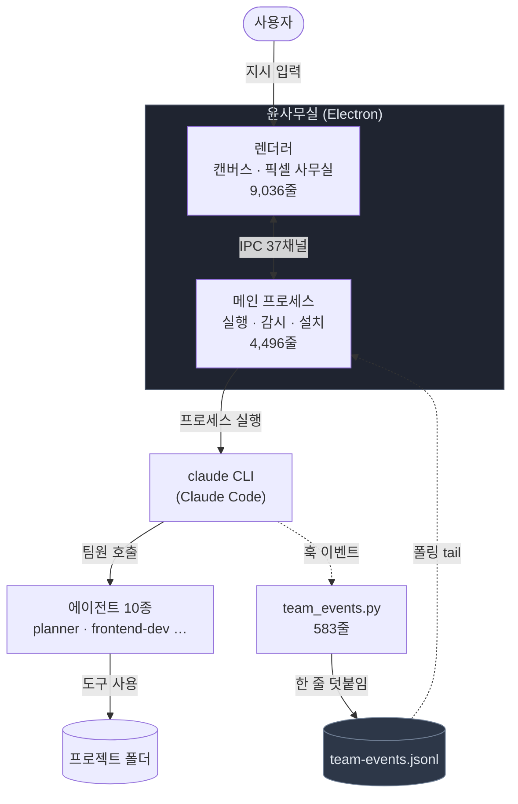
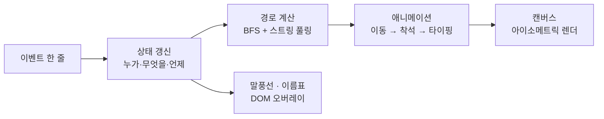
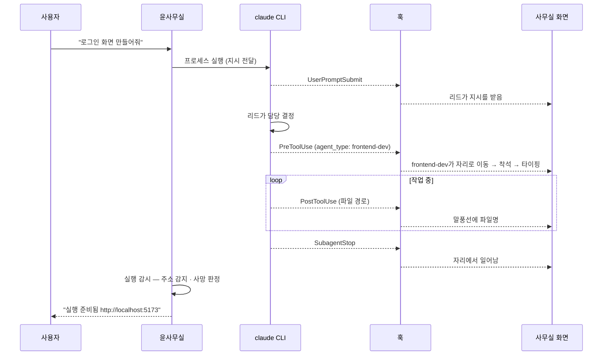
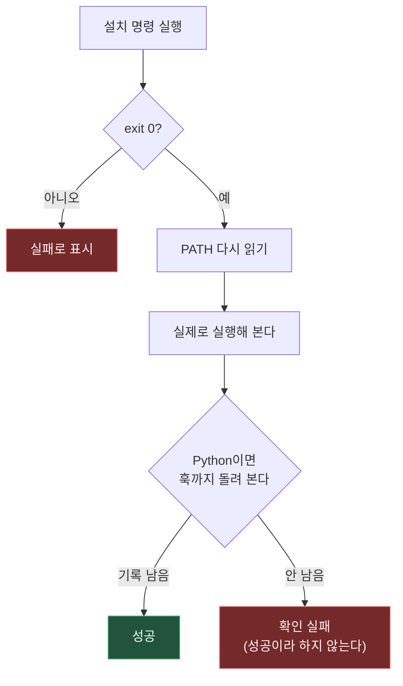

# 동작 흐름

> 지시 한 줄이 캐릭터의 움직임이 되기까지.

---

## 전체 구조

핵심은 **점선**이다. 앱은 Claude Code의 출력을 파싱하지 않는다. Claude Code가 훅으로 내보내는 **구조화된 이벤트**를 읽는다. 그래서 로그 형식이 바뀌어도 깨지지 않고, 무엇보다 **지어낼 수 없다** — 이벤트가 없으면 캐릭터도 움직이지 않는다.

---

## 이벤트가 만들어지는 지점

Claude Code는 정해진 순간에 훅 스크립트를 호출하고 JSON을 stdin으로 넘긴다. 6종을 구독한다.

| 훅 | 언제 | 화면에서 |
|---|---|---|
| `UserPromptSubmit` | 사용자가 지시를 넣을 때 | 리드가 지시를 받음 |
| `PreToolUse` | 도구를 쓰기 **직전** | 담당자가 자리로 이동, 활동 배지 시작 |
| `PostToolUse` | 도구를 쓴 **직후** | 말풍선에 만진 파일 표시 |
| `SubagentStop` | 팀원이 일을 마칠 때 | 자리에서 일어남 |
| `Stop` | 응답이 끝날 때 | 대기 상태로 |
| `SessionStart` | 세션이 시작될 때 | 출근 |

훅은 **Python 표준 라이브러리만** 쓴다(`json`/`os`/`re`/`sys`/`time`). 남의 컴퓨터에서 도는 스크립트에 의존성을 요구하지 않기 위해서다.

### 누가 한 일인지 알아내기

여러 팀원이 동시에 일할 때 **이 도구 호출이 누구 것인가**를 알아야 한다. 처음에는 호출 순서로 추측했는데 틀렸다.

훅 페이로드에 `agent_type`과 `agent_id`가 실려 온다는 것을 발견하고 그 값을 쓰도록 바꿨다. 추측 방식은 검증 테스트 15개 중 **8개에서 잘못된 사람을 지목**했고, 바꾼 뒤 전부 통과했다.

> 이 발견 전까지는 "일이 엉뚱한 사람에게 붙는다"는 증상만 보였다. 원인을 세 번 다른 곳에서 찾다가 결국 페이로드를 다시 읽고 찾았다.

---

## 파일을 읽는 방식 — 왜 폴링인가

이벤트는 `<프로젝트>/.claude/team-events.jsonl`에 **한 줄씩 덧붙는다**(JSON Lines). 앱은 이 파일을 tail 한다.

일반적인 선택은 `fs.watch`지만 **폴링을 쓴다.** Windows에서 `fs.watch`가 "덧붙이기"를 신뢰성 있게 잡지 못하기 때문이다. 이벤트를 놓치면 캐릭터가 멈춘 채로 남고, 사용자는 작업이 멈춘 줄 안다. **놓치지 않는 것이 CPU보다 중요한 자리**라 폴링을 택했다.

---

## 화면에 그리는 방식

**아이소메트릭 렌더링** — 44×22 픽셀 타일(2:1 비율)에 격자 좌표를 화면 좌표로 변환해 그린다. 스프라이트는 코드로 그린다(외부 에셋 없음).

**이름표·말풍선은 캔버스가 아니라 DOM**이다. 도트 배율(2~4배)에 묶이면 글자가 읽히지 않기 때문이다. 대신 캔버스 위 좌표에 맞춰 매 프레임 위치를 갱신한다.

**길찾기** — 처음에는 방과 문만 알고 직선으로 움직였다. 그래서 캐릭터가 **책상과 소파를 통과해 걸어 다녔다.** 0.25칸 격자의 내비게이션 그리드를 만들고 BFS로 경로를 찾은 뒤, 스트링 풀링으로 꺾인 경로를 펴서 자연스럽게 만들었다. 가구가 통로를 막아 자리가 고립되는 경우를 자동으로 잡는 검사(`check-nav.js`)도 함께 만들었다.

---

## 지시가 실행되는 흐름

### "실행 준비됨"을 언제 말하는가

개발 서버가 뜨면 주소를 잡아 사용자에게 링크를 준다. 그런데 **주소를 봤다는 것과 서버가 살아 있다는 것은 다르다.** 주소를 출력한 직후 죽는 경우가 실제로 있었다(`vite`가 주소를 찍고 `Exit status 1`).

그래서 주소를 본 뒤 **4초를 더 지켜보고**, 그 사이 사망 신호가 없을 때만 "준비됨"이라고 한다. 사망 판정 문구는 실제 로그에서 수집했다.

또 하나 — 스트림 청크가 포트 번호 중간에서 잘려 `http://localhost:` 까지만 잡히는 일이 있었다. stdout·stderr에 각각 별도 줄 버퍼를 두어 해결했다.

---

## 첫 실행 설치 흐름

비개발자가 설치 파일만으로 시작할 수 있도록 6단계 마법사를 둔다.

| 항목 | 설치 방법 | 비고 |
|---|---|---|
| Python | winget · `Python.Python.3.13` | burn 번들이라 UAC가 뜰 수 있음 → 미리 예고 |
| Claude Code | 공식 설치 스크립트 | winget 불필요 (PowerShell만) |
| Git *(선택)* | winget · `Git.MinGit` | 되돌리기 기능에 필요 |

**Node.js는 필요 없다.** 예전에는 Claude Code를 npm으로 깔아 Node가 먼저 있어야 했지만, 공식 스크립트가 실행 파일을 직접 앉히므로 비개발자에게 "런타임부터 까세요"라고 말할 이유가 사라졌다.

### 설치를 믿지 않는 구조

`exit 0`을 믿지 않는 이유는 실측에서 나왔다.

- **winget은 링크 생성이 실패해도 0을 준다.** 포터블 패키지는 `%LOCALAPPDATA%\Microsoft\WinGet\Links`에 심볼릭 링크를 거는데, 이 링크는 관리자이거나 개발자 모드일 때만 만들 수 있다. 비개발자 PC의 기본값이 정확히 그 반대다. 깔렸는데 없다고 나오는 상황이 여기서 생긴다 → 링크가 실패했으면 앱이 PATH를 직접 고친다.
- **`python --version`은 Microsoft Store 스텁도 통과한다.** 그래서 버전이 아니라 **행동**으로 판단한다 — 진짜 훅을 한 번 돌려 이벤트 파일이 생기는지 본다. 스텁은 그걸 못 한다.

> 반대 방향의 실수도 있었다. 이 PC의 `where python` 첫 줄이 `...\WindowsApps\python.exe`라 경로만 보고 "스토어 스텁"이라 판단할 뻔했는데, 실제로는 정상 동작하는 Store판 Python 3.13.14였다. 경로로 막았으면 멀쩡한 python을 없다고 했을 것이다.

---

## 프로세스 경계

| 층 | 실행 위치 | 하는 일 |
|---|---|---|
| 렌더러 | 샌드박스 | 그리기, 입력. **Node API 접근 없음** |
| preload | 브리지 | 44개 API만 노출 |
| 메인 | Node | 파일·프로세스·설치·네트워크 |

렌더러가 샌드박스라 클립보드조차 직접 못 쓴다. 채팅 복사 아이콘이 처음에 동작하지 않은 원인이 이것이었고, IPC로 메인에 넘겨 해결했다. **불편하지만 경계를 무르게 만들지 않는 쪽**을 택했다.
