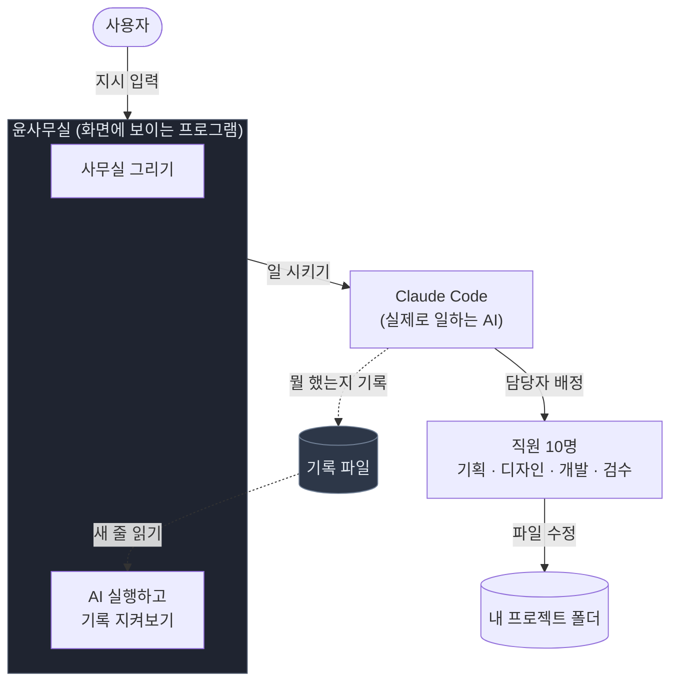
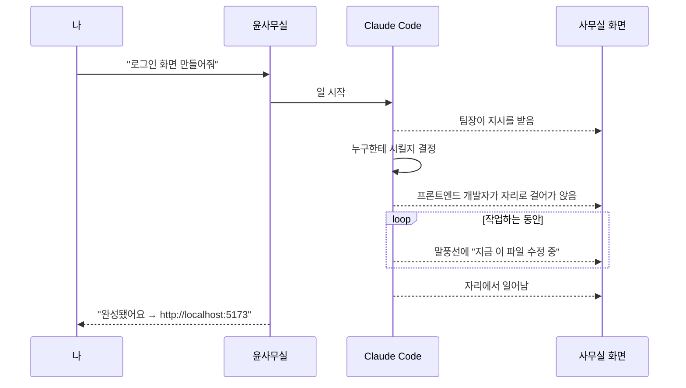
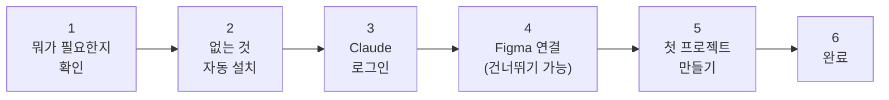

# 어떻게 움직이나

> "로그인 화면 만들어줘" 한 줄이 캐릭터의 움직임이 되기까지.

---

## 비유로 먼저

이 프로그램은 **CCTV 같은 것**입니다.

직접 일을 하지는 않습니다. 실제로 일하는 건 AI(Claude Code)이고, 이 프로그램은 **그 모습을 지켜보고 그려줄 뿐**입니다.

중요한 건 **어떻게 지켜보느냐**입니다. 두 가지 방법이 있었습니다.

| 방법 | 비유 | 문제 |
|---|---|---|
| AI가 화면에 출력하는 글자를 읽어서 해석 | 옆에서 어깨너머로 훔쳐보기 | 글자 형식이 조금만 바뀌어도 못 알아봅니다 |
| **AI가 직접 남기는 기록을 읽기** | **출퇴근 기록기** | 형식이 정해져 있어 안 깨집니다 |

**두 번째를 골랐습니다.** AI가 뭔가 할 때마다 자동으로 기록을 한 줄씩 남기게 해두고, 프로그램은 그 기록만 읽습니다.

이 선택 덕분에 앞서 말한 원칙이 지켜집니다 — **기록이 없으면 캐릭터도 안 움직입니다.** 지어낼 수가 없는 구조입니다.

---

## 전체 그림

**점선이 핵심입니다.** 프로그램은 AI를 직접 감시하지 않습니다. AI가 남긴 기록만 읽습니다.

---

## 한 번의 지시가 흘러가는 순서

### 기록에 담기는 것

AI는 정해진 6가지 순간에 기록을 남깁니다.

| 언제 | 화면에서는 |
|---|---|
| 내가 지시를 넣었을 때 | 팀장이 지시를 받음 |
| 파일을 건드리기 **직전** | 담당자가 자리로 이동, 타이핑 시작 |
| 파일을 건드린 **직후** | 말풍선에 파일 이름 |
| 한 직원이 일을 마쳤을 때 | 자리에서 일어남 |
| 답변이 끝났을 때 | 대기 상태로 |
| 프로그램을 켰을 때 | 출근 |

### "누가 한 일인지" 알아내기

여러 명이 동시에 일하면 **이 작업이 누구 것인지** 알아야 합니다.

처음에는 순서를 보고 짐작했습니다. **틀렸습니다.** 엉뚱한 사람이 일하는 것처럼 보였습니다.

원인을 세 군데에서 찾다가, 결국 기록을 다시 읽어봤더니 **거기에 이미 "누가 했는지"가 적혀 있었습니다.** 짐작하지 말고 그 값을 쓰도록 바꿨습니다.

> 확인해보니 짐작 방식은 시험 15개 중 **8개에서 엉뚱한 사람을 지목**하고 있었습니다. 바꾼 뒤에는 전부 맞았습니다.

이때 배운 게 있습니다. **추론하기 전에 데이터를 다시 읽는 게 빠르다.**

---

## 화면을 그리는 방식

**캐릭터는 코드로 직접 그립니다.** 그림 파일을 쓰지 않고 픽셀을 하나씩 찍습니다.

**이름표와 말풍선은 캐릭터와 다른 방식으로 그립니다.** 캐릭터는 도트라서 확대하면 계단처럼 각지는데, 글자까지 그렇게 되면 읽을 수가 없기 때문입니다. 글자는 선명하게 유지하면서 캐릭터 위치만 따라다니게 했습니다.

### 길찾기 — 가구를 뚫고 다니던 문제

처음에는 캐릭터가 목적지까지 **직선으로** 움직였습니다. 그래서 **책상과 소파를 그냥 통과해서 걸어 다녔습니다.**

사무실을 잘게 나눈 격자를 만들고, 가구가 없는 칸만 밟아서 돌아가도록 길을 찾게 바꿨습니다. 그런데 이렇게만 하면 계단처럼 지그재그로 걸어서 부자연스러웠습니다. 그래서 꺾인 길을 다시 펴주는 과정을 한 번 더 넣었습니다.

덤으로 **가구를 잘못 배치해서 자리가 갇히는 경우를 자동으로 잡아내는 검사**도 만들었습니다. 78개 지점을 매번 확인합니다.

---

## 개발 서버 주소를 알려줄 때

AI가 작업을 끝내면 보통 웹사이트 미리보기 주소가 생깁니다. 그걸 잡아서 링크로 줍니다.

여기서 실수를 두 번 했습니다.

**① 주소를 봤다고 다 된 게 아니었습니다.**
주소를 화면에 찍은 **직후에 죽어버리는** 경우가 있었습니다. 사용자는 링크를 눌렀는데 아무것도 안 뜹니다.
→ 주소를 본 뒤 **4초를 더 지켜보고**, 그 사이 죽지 않았을 때만 "준비됐다"고 말하게 바꿨습니다.

**② 주소가 잘렸습니다.**
`http://localhost:5173` 이어야 하는데 `http://localhost:` 까지만 잡혔습니다. 글자가 조각조각 나뉘어 들어오는데 그걸 그대로 읽어서 그랬습니다.
→ 조각들을 한 줄이 완성될 때까지 모아뒀다가 읽도록 바꿨습니다.

둘 다 **"거의 맞는데 가끔 틀리는"** 종류라서, 처음엔 왜 그러는지 한참 몰랐습니다.

---

## 처음 켰을 때 (설치 도우미)

컴퓨터를 잘 모르는 사람도 쓸 수 있어야 해서, 처음 켜면 6단계 안내가 뜹니다.

**2단계에서 앱이 대신 깔아줍니다.** 사람이 할 일은 3단계 로그인뿐입니다.

### 여기서 제일 신경 쓴 것

**설치 프로그램이 "성공"이라고 해도 믿지 않습니다.**

이유가 있습니다. 실제로 확인해보니:

- 윈도우 설치 도구가 **실패했는데도 "성공"이라고 답하는 경우**가 있었습니다. 그것도 일반 사용자 컴퓨터에서 더 자주 일어나는 조건이었습니다.
- Python은 **가짜가 깔려 있어도 "버전 확인"은 통과**합니다. 마이크로소프트 스토어가 넣어두는 껍데기가 있는데, 버전만 물어보면 대답을 합니다.

그래서 **직접 한 번 시켜보고** 진짜 결과가 나오는지 확인합니다. 껍데기는 그걸 못 합니다.

> 반대로 실수할 뻔한 적도 있습니다. 경로만 보고 "이건 가짜네" 하고 막으려 했는데, 확인해보니 **정상 작동하는 진짜**였습니다. 경로로 판단했으면 멀쩡한 걸 없다고 할 뻔했습니다.

---

<b>더 깊이 — 기술 상세 (개발자용)</b>

**이벤트 파이프라인**
- Claude Code 훅 6종(`UserPromptSubmit`/`PreToolUse`/`PostToolUse`/`SubagentStop`/`Stop`/`SessionStart`) → `hooks/team_events.py`(583줄, 표준 라이브러리만) → `<프로젝트>/.claude/team-events.jsonl`
- 앱은 이 파일을 tail. **`fs.watch`가 아니라 폴링** — Windows에서 `fs.watch`가 append를 신뢰성 있게 잡지 못한다. 이벤트를 놓치면 캐릭터가 멈춘 채로 남으므로 CPU보다 정확성을 택했다
- 에이전트 귀속은 훅 페이로드의 `agent_type`/`agent_id` 사용(추론 방식은 15개 중 8개 오답)

**렌더링**
- 아이소메트릭 44×22 타일(2:1). 스프라이트는 코드 생성, 외부 에셋 0
- 이름표·말풍선은 캔버스가 아닌 DOM 오버레이(도트 배율 2~4배에서 글자 가독성). `#overlay`에 `isolation: isolate`로 z-index를 사무실 안에 가둠
- 길찾기: 0.25칸 격자 BFS + 스트링 풀링. `check-nav.js`가 배치 2가지 · 지점 78곳 검증

**실행 감시**
- 주소 감지 후 4초 settle + 사망 신호 판정(실제 로그에서 수집)
- stdout/stderr 각각 별도 줄 버퍼(청크 경계에서 포트가 잘리던 문제)

**설치 검증**
- `exit 0`을 신뢰하지 않음. winget 포터블은 심볼릭 링크 실패 시에도 0을 반환(개발자 모드 꺼진 PC 기본값) → 실패 시 앱이 PATH를 직접 보정
- Python은 버전이 아니라 **행동**으로 판정 — 실제 훅을 실행해 이벤트 파일 생성 여부 확인(Store 스텁 판별)
- 무인 설치 플래그 4종 필수(하나라도 빠지면 winget이 입력 대기로 멈춤), 타임아웃 5분 / UAC 항목 10분

**프로세스 경계**
- 렌더러 샌드박스(Node API 없음) → preload 44 API → 메인. IPC 37채널
- 클립보드조차 IPC 경유(샌드박스에서 직접 접근 불가). 경계를 무르게 만들지 않는 쪽을 택함

