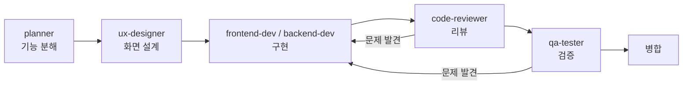

# 개발 기록

> 무엇으로, 어떻게 만들었고, 무엇을 배웠나.

---

## 기술 스택

| 영역 | 선택 | 이유 |
|---|---|---|
| 런타임 | **Electron 33** | Windows 데스크톱 + 웹 기술로 캔버스 렌더. 파일 감시·프로세스 실행에 Node가 필요 |
| 언어 | **JavaScript (ES2022)** | 빌드 단계 없이 소스 그대로 실행·검사. 트랜스파일러가 없어 스택 트레이스가 실제 줄 번호 |
| 렌더링 | **Canvas 2D** (프레임워크 없음) | 도트 캐릭터를 픽셀 단위로 제어해야 함. DOM으로는 수십 개 스프라이트가 버거움 |
| 훅 | **Python 3** (표준 라이브러리만) | Claude Code 훅의 사실상 표준. 남의 PC에 의존성을 요구하지 않기 위해 |
| 패키징 | **electron-builder** (NSIS + portable) | 설치본·무설치본 동시 생성 |
| 패키지 매니저 | **pnpm** | electron 바이너리 캐시 공유 |
| CI | **GitHub Actions** (windows-latest) | 1인 저장소라 사람 리뷰 대신 자동 검사가 게이트 |

### 런타임 의존성 0개

`package.json`의 `dependencies`가 **비어 있다.** devDependencies는 `electron`과 `electron-builder` 둘뿐이다.

의도적이다. 이 앱은 남의 컴퓨터에 설치되고, 설치 과정 자체가 이미 실패 지점이 많다(SmartScreen, winget, UAC, PATH). 여기에 npm 의존성 트리까지 얹으면 실패 표면이 넓어진다. 필요한 것은 전부 Node 표준 API와 Electron API로 해결했다.

- 파일 감시 → `fs` 폴링
- HTTP → 쓰지 않음(설치는 `winget`/PowerShell에 위임)
- 상태 저장 → `JSON` + `app.getPath('userData')`
- 아이콘 생성 → 캔버스로 직접 그려 `.ico` 생성 (`tools/make-icon.js`)

---

## 코드 구성

```
main.js          3,686줄   실행·감시·설치·IPC 37채널
install.js         742줄   무인 설치와 검증
preload.js          68줄   브리지 (44개 API)
renderer/        9,036줄   캔버스 렌더 · 마법사 · 스타일 (10파일)
hooks/             583줄   Python 훅
tools/           3,843줄   자동 검사 (8파일)
```

| 구분 | 줄 수 | 비중 |
|---|---:|---:|
| 제품 코드 | 14,115 | 79% |
| **자동 검사** | **3,843** | **21%** |

---

## 개발 플로우

이 프로젝트는 **자기 자신이 시각화하는 방식으로 개발됐다.** Claude Code의 역할별 팀 에이전트에게 위임하고 결과를 검증하는 구조다.



**규칙 두 개를 지켰다.**

1. **리뷰·검증을 통과하지 않은 변경을 "완료"로 보고하지 않는다.**
2. **되돌리기 힘든 작업**(커밋·푸시·배포·마이그레이션)은 사람 확인 후 실행한다.

에이전트 보고를 그대로 믿지 않는 것도 규칙이었다. 실제로 한 리뷰 에이전트가 "인터넷이 끊기면 잘못된 안내가 뜬다"는 결함을 [위험]으로 보고했는데, 같은 명령 형태를 존재하지 않는 주소로 직접 돌려 보니 **종료 코드가 1이라 재현되지 않았다.** 그대로 믿었으면 없는 버그를 고치러 갔을 것이다.

### 커밋 분포

| 타입 | 수 |
|---|---:|
| `fix` | 49 |
| `feat` | 44 |
| `chore` | 18 |
| 기타 | 28 |
| **합계** | **139** |

`fix`가 `feat`보다 많다. 기능을 넓히기보다 **실제로 겪은 결함을 좁히는 데 시간을 더 썼다**는 뜻이고, 아래 사고 기록이 그 내용이다.

---

## 검증 전략

캔버스 앱은 참조 하나가 끊기면 `draw()`가 통째로 죽고 **화면이 텅 빈다.** 원인을 눈으로 찾기 어렵다(벽만 남거나 아무것도 안 보임). 실제로 두 번 당한 뒤 검사를 기계화했다.

| 검사 | 무엇을 잡나 | 규모 |
|---|---|---|
| `check-refs` | 끊긴 참조, 문법 오류, **설치본에서 빠지는 파일** | 128줄 |
| `check-nav` | 가구가 통로를 막아 고립된 자리 | 108줄 / 지점 78곳 |
| `check-logic` | 함수를 떼어 실제로 실행 | 2,206줄 / **단언 481개** |
| `check-ui` | Electron을 띄워 잘림·겹침·대비 측정 | 149줄 / **갈래 36가지** |

전체 실행 시간 약 4분(로직 45초 + 화면 163초).

### 검사가 거짓말하지 않게 하기

**검사를 추가할 때마다 결함을 일부러 심어 실제로 잡히는지 확인했다.** 통과만 보고 안심하면 검사가 무의미해지기 때문이다. 이 습관이 실제로 세 번 문제를 잡았다.

**① 검사가 조용히 통과하고 있었다**
`check-refs`가 `main.js`의 문법을 본다고 믿었는데, `vm.SourceTextModule`이 플래그 없이는 `undefined`라 **검사 자체가 아무것도 안 하고 통과**하고 있었다. 그 사이 문법 오류가 그대로 새어 나갔다. `node --check`로 바꾸고, 오류를 심어서 잡히는 것을 확인했다.

**② 스텁이 없는 계약을 지어냈다**
화면 검사용 스텁이 프로덕션에 **존재하지 않는 필드**를 내보내고 있었다. 그 위에서 테스트 6개가 초록이었고, 정작 실제 배선은 끊겨 있었다. 죽은 판정 함수를 지우고 검사를 살아 있는 함수로 옮긴 뒤, 가드를 제거해 봐서 잡히는 것을 확인했다.

**③ 검사가 볼 수 없는 조건만 보고 있었다**
설치 마법사 검사 6갈래가 **전부 "붙은 프로젝트 0개"** 상태였다. 그 상태에서는 캐릭터가 화면에서 내려가므로, 이름표가 마법사를 가리는 결함이 **원리적으로 나타날 수 없었다.** 사람이 있는 채로 마법사가 뜨는 갈래를 추가하니 즉시 잡혔다.

---

## 기억에 남는 사고 5건

| 증상 | 진짜 원인 | 배운 것 |
|---|---|---|
| 설치본만 죽음 | `main.js`가 `require`하는 새 파일이 `build.files` 허용 목록에 없었음 | 개발 중엔 멀쩡하고 **설치본에서만** 나는 결함이 있다 |
| 설치본에서 Python이 영원히 "없음" | 훅 경로를 python에 넘겼는데 그 경로가 `app.asar` **안**이었음. `fs.existsSync`는 Electron이 패치해 true를 주지만 외부 프로세스는 못 연다 | 같은 경로도 **누가 여느냐**에 따라 다르다 |
| 앱을 켤 때마다 특정 팀원이 빨간색 | 재생된 과거 이벤트에 **현재 시각**으로 타이머를 걸어 "지금 실패 중"으로 보였음 | 과거 데이터와 실시간 데이터를 섞지 말 것 |
| `'-'을(를) 찾을 수 없습니다` | libuv가 이미 인용한 인자를 손으로 한 번 더 감쌌고, `cmd`가 `\"`를 이스케이프가 아닌 **토글**로 해석 | 플랫폼별 인용 규칙은 추측하지 말 것 |
| 개발 서버 주소의 포트가 잘림 | 스트림 청크가 포트 중간에서 끊겼는데 raw 청크를 그대로 파싱 | 스트림은 줄 단위가 아니다 |

### 실수 하나

작업을 정리하다 **검증까지 끝난 코드를 과하게 되돌려** 날린 적이 있다. 백업에서 복원했고, 그 뒤로는 **되돌리기 힘든 작업 전에 반드시 백업하고 복원 후 해시를 대조**하는 절차를 지켰다. 검사를 심을 때 아직 git에 없는 파일(untracked)을 건드려야 하는 경우가 있었는데, git으로는 복원할 수 없으므로 이 절차가 필수였다.

---

## 배포

- 코드 서명 없음 → SmartScreen 경고가 뜬다. 인증서 대신 **안내 문서**로 대응하고, "왜 뜨는지"와 "출처로 판단하라"를 정직하게 적었다
- NSIS 설치본 + 무설치 포터블 동시 제공 (각 78MB)
- 아이콘·버전 정보는 `afterPack`에서 rcedit로 주입 후 **되읽어 검증**

### 검증된 것과 안 된 것

포트폴리오 문서로서 이 구분을 분명히 둔다.

**검증됨** — 설치본 빌드·실행·종료, asar 내부 파일 접근, 자동 검사 4종, 훅 이벤트 파이프라인, 패키징 산출물

**미검증** — winget으로 Python·Git이 **실제로 깔리는 과정**, UAC 창, winget이 정책으로 막힌 PC, SmartScreen 실제 화면

개발 PC에 Python과 Claude Code가 이미 있어 마법사가 설치를 건너뛰기 때문이다. 깨끗한 Windows에서 사람이 따라 하며 확인할 [테스트 절차서](../설치-테스트-절차.md)를 작성해 두었고, 모든 항목은 현재 "미확인" 상태다.

---

## 다시 한다면

- **에이전트 귀속을 먼저 확인했을 것.** 훅 페이로드에 답(`agent_type`)이 있는데 세 번 다른 곳에서 원인을 찾았다. 데이터를 다시 읽는 것이 추론보다 빨랐다.
- **검사 스텁과 프로덕션의 계약을 처음부터 기계로 묶었을 것.** 나중에 계약 검사를 넣고서야 두 곳이 어긋나 있던 것을 알았다.
- **CI를 첫 주에 세웠을 것.** 11일 중 10일을 로컬 검사에만 의존했다.
