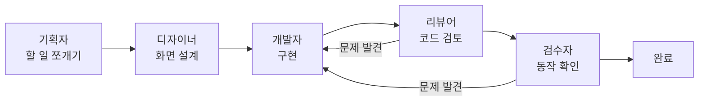

# 어떻게 만들었나

> 무엇으로 만들었고, 어떻게 일했고, 뭘 배웠나.

---

## 무엇으로 만들었나

| 무엇을 | 뭘로 | 왜 그걸 골랐나 |
|---|---|---|
| 프로그램 껍데기 | **Electron** | 윈도우 프로그램을 웹 기술로 만들 수 있습니다. 파일을 지켜보고 다른 프로그램을 실행하는 기능이 필요했습니다 |
| 코드 | **JavaScript** | 빌드(변환) 과정 없이 짠 그대로 돌아갑니다. 오류가 나면 **진짜 그 줄 번호**가 나와서 찾기 쉽습니다 |
| 사무실 그림 | **Canvas** (그림판 같은 것) | 캐릭터를 점 단위로 그려야 해서 직접 그리는 방식이 필요했습니다 |
| 기록 담당 | **Python** | AI 기록 기능이 원래 이 언어를 씁니다 |
| 설치 파일 만들기 | **electron-builder** | 설치본과 무설치본을 같이 만들어줍니다 |

### 다른 프로그램을 하나도 안 쓴 이유

보통 이런 프로그램은 남이 만든 부품(라이브러리)을 수십 개씩 가져다 씁니다. **이 프로젝트는 0개입니다.**

이유는 단순합니다. 이 프로그램은 **남의 컴퓨터에 설치**됩니다. 설치 과정에서 이미 실패할 수 있는 지점이 많습니다 — 윈도우 경고, 관리자 권한, 인터넷 문제 등. 여기에 부품 수십 개를 더 얹으면 **고장 날 수 있는 곳이 그만큼 늘어납니다.**

필요한 건 전부 기본 기능으로 해결했습니다. 프로그램 아이콘조차 그림 파일을 가져오지 않고 코드로 직접 그렸습니다.

---

## 어떻게 일했나

재미있는 점이 있습니다. **이 프로그램은 자기가 보여주는 방식 그대로 만들어졌습니다.**

즉, AI 팀원들에게 역할을 나눠 맡기고 검증하는 방식으로 개발했습니다.



**두 가지 규칙을 지켰습니다.**

1. **검토와 검수를 통과하지 않은 건 "완료"라고 하지 않는다.**
2. **되돌리기 어려운 일**(코드 저장, 배포 등)은 **사람 확인을 받고** 한다.

### AI 말을 그대로 믿지 않기

여기서 중요한 게 하나 더 있었습니다. **AI 팀원의 보고를 검증 없이 믿으면 안 됩니다.**

실제 사례입니다. 검토 담당 AI가 "인터넷이 끊기면 사용자에게 잘못된 안내가 뜬다"는 문제를 **[위험]** 등급으로 보고했습니다. 그럴듯했습니다.

직접 재현해봤습니다. **재현되지 않았습니다.** 실제로는 프로그램이 제대로 실패 처리를 하고 있었습니다.

그대로 믿었으면 **있지도 않은 버그를 고치느라** 시간을 썼을 겁니다.

### 작업 기록

11일 동안 139번 저장했습니다.

| 종류 | 횟수 |
|---|---:|
| **버그 수정** | **49** |
| 기능 추가 | 44 |
| 정리 | 18 |
| 기타 | 28 |

**버그 수정이 기능 추가보다 많습니다.** 기능을 계속 늘리기보다 **실제로 겪은 문제를 없애는 데** 시간을 더 썼다는 뜻입니다. 아래가 그 내용입니다.

---

## 오류를 잡는 장치를 따로 만들었다

이런 종류의 프로그램은 **작은 실수 하나에 화면이 통째로 하얘집니다.** 그림을 그리다가 중간에 오류가 나면 그 뒤로 아무것도 안 그려지기 때문입니다.

문제는 **왜 그런지 화면만 봐서는 모른다**는 겁니다. 그냥 텅 비어 있습니다. 실제로 두 번 당하고 나서, 사람이 눈으로 찾는 걸 포기하고 **자동으로 검사하는 프로그램을 따로 만들었습니다.**

| 검사 | 뭘 잡나 |
|---|---|
| 참조 검사 | 없는 걸 갖다 쓰는 코드, 오타 |
| 동선 검사 | 가구를 잘못 놓아서 갇힌 자리 |
| 논리 검사 | 실제로 함수를 돌려보고 결과가 맞는지 (**481가지**) |
| 화면 검사 | 진짜로 화면을 띄워서 글자가 잘리거나 겹치는지 (**36가지 상황**) |

전부 도는 데 4분 걸립니다. **검사 코드만 3,800줄** — 전체 코드의 4분의 1이 넘습니다.

### 그런데 검사도 거짓말을 합니다

여기가 이 프로젝트에서 제일 배운 게 많은 부분입니다.

**검사를 만들 때마다, 일부러 오류를 심어서 진짜 잡히는지 확인했습니다.** "통과했으니 됐지" 하고 넘어가면 안 되기 때문입니다.

이 습관 덕분에 **세 번** 걸렸습니다.

**① 검사가 아무것도 안 하고 있었다**
문법 오류를 잡는다고 믿었던 검사가, 알고 보니 **아무 검사도 안 하고 그냥 통과**시키고 있었습니다. 그 사이 오류가 그대로 새어 나갔습니다.

**② 검사용 가짜 데이터가 없는 걸 지어냈다**
화면 검사에 쓰는 가짜 데이터가 **실제 프로그램에는 없는 정보**를 만들어내고 있었습니다. 그 위에서 테스트 6개가 초록불이었는데, 정작 진짜 연결은 끊겨 있었습니다.

**③ 검사가 문제가 생길 수 없는 상황만 보고 있었다**
설치 화면 검사 6가지가 **전부 "프로젝트가 없는 상태"**였습니다. 그 상태에선 캐릭터가 화면에 없으니, "캐릭터가 설치 화면을 가린다"는 문제가 **애초에 일어날 수 없었습니다.** 캐릭터가 있는 상황을 추가하니 바로 잡혔습니다.

> **셋 다 "초록불인데 실제로는 안 되는" 상태였습니다.** 검사를 믿기 전에 검사를 검사해야 한다는 걸 배웠습니다.

---

## 기억에 남는 문제 5가지

| 증상 | 진짜 원인 | 배운 것 |
|---|---|---|
| 내 컴퓨터에선 되는데 **설치하면 죽음** | 새로 만든 파일을 설치본에 넣는 목록에서 빠뜨림 | 개발할 때와 설치했을 때가 다를 수 있다 |
| 설치본에서 **Python이 영원히 "없음"** | 설치본은 파일이 압축돼 있는데, 그 안의 파일을 밖에서 열려고 함 | 같은 파일도 **누가 여느냐**에 따라 다르다 |
| 켤 때마다 **특정 직원이 빨간색** | 과거 기록을 다시 읽으면서 시간을 **현재 시각**으로 계산 → "지금 실패 중"으로 보임 | 과거 데이터와 실시간 데이터를 섞으면 안 된다 |
| 명령 실행이 **엉뚱한 오류**를 냄 | 따옴표를 한 번 더 감쌌는데, 윈도우가 그걸 다르게 해석 | 짐작하지 말고 확인할 것 |
| 주소 뒷부분이 **잘림** | 글자가 조각나서 들어오는데 그대로 읽음 | 데이터는 항상 온전하게 오지 않는다 |

**공통점이 있습니다.** 전부 **증상과 원인이 전혀 다른 곳에 있었습니다.** 그래서 "왜 이러지?" 하고 짐작하는 대신, 실제로 재현해보고 데이터를 다시 읽는 습관이 생겼습니다.

### 제가 한 실수

작업을 정리하다가 **검증까지 끝난 코드를 과하게 되돌려서 날린 적**이 있습니다.

백업에서 복구했고, 그 뒤로는 **되돌리기 전에 반드시 백업하고, 복구한 다음 원본과 같은지 대조**하는 절차를 지켰습니다.

---

## 배포

- **설치본(78MB)과 무설치본(78MB)** 두 가지를 만듭니다
- 코드 서명(인증서)을 안 해서 **윈도우 경고가 뜹니다.** 인증서를 사는 대신 **안내 문서**로 대응했습니다. "왜 이 경고가 뜨는지"와 "받은 출처를 보고 판단하라"를 솔직하게 적었습니다

### 확인한 것과 아직 못 한 것

**확인함** — 설치본이 만들어지고 실행되는 것, 자동 검사 4종, 기록 파이프라인 전체

**아직 못 함** — **필요한 프로그램이 실제로 설치되는 과정.** 제 컴퓨터엔 이미 다 깔려 있어서 프로그램이 설치를 건너뛰기 때문입니다

이걸 확인하려면 **아무것도 안 깔린 깨끗한 윈도우**에서 한 번 돌려봐야 합니다. 그때 확인할 항목을 정리한 [테스트 절차서](../설치-테스트-절차.md)를 만들어뒀고, 현재 모든 항목이 "미확인" 상태입니다.

> 포트폴리오에 "완성됐다"고 쓸 수도 있었지만, **확인한 것과 안 한 것을 구분해서 관리하는 게** 더 정확하다고 판단했습니다.

---

## 다시 만든다면

- **기록에 답이 있는지 먼저 봤을 것.** "누가 한 일인지" 알아내려고 세 군데를 뒤졌는데, 답은 처음부터 데이터 안에 있었습니다
- **검사용 가짜 데이터와 진짜를 처음부터 묶어뒀을 것.** 나중에 확인 장치를 넣고서야 둘이 어긋나 있던 걸 알았습니다
- **자동 검사를 첫 주에 세팅했을 것.** 11일 중 10일을 수동으로 돌렸습니다

---

<details>
<summary><b>더 깊이 — 기술 상세 (개발자용)</b></summary>

**스택**: Electron 33 / JavaScript ES2022(트랜스파일 없음) / Canvas 2D / Python 3(표준 라이브러리만) / pnpm / electron-builder(NSIS + portable) / GitHub Actions

**의존성 0의 실제 구현**
- 파일 감시 → `fs` 폴링 (Windows `fs.watch`의 append 누락 회피)
- 상태 저장 → JSON + `app.getPath('userData')`
- 아이콘 생성 → Canvas로 `.ico` 직접 생성(`tools/make-icon.js`)
- HTTP 없음 — 설치는 winget/PowerShell에 위임

**코드 구성**
```
main.js       3,686줄   실행·감시·설치·IPC 37채널
install.js      742줄   무인 설치와 검증
preload.js       68줄   브리지 44 API
renderer/     9,036줄   캔버스 렌더·마법사 (10파일)
hooks/          583줄   Python 훅
tools/        3,843줄   자동 검사 (8파일)
```
제품 14,115줄 : 검사 3,843줄 = **약 3.7 : 1**

**검사 구성**
| 도구 | 규모 | 방식 |
|---|---|---|
| `check-refs` | 128줄 | `node --check` + 참조 그래프 + `build.files` 커버리지 |
| `check-nav` | 108줄 | 배치 2가지 · 지점 78곳 BFS 도달성 |
| `check-logic` | 2,206줄 | 함수를 소스에서 추출해 실행. 단언 481개, 45초 |
| `check-ui` | 149줄 | Electron 실제 기동, 갈래 36가지, 163초 |

**CI** — `windows-latest`에서 참조·동선·로직 3종. 화면 검사는 폰트(`Malgun Gothic`) 의존성 때문에 러너 검증 전까지 수동 워크플로로 분리. 세 검사는 `node_modules` 없이 동작(검사 대상 코드가 `require('electron')`을 하지만 `Module._load` 가로채기로 대체) → 설치·캐시 단계 자체가 없음

**회귀 심기(planted regression)** — 검사를 추가할 때마다 결함을 의도적으로 주입해 검출을 확인. 미추적 파일은 git으로 복원 불가하므로 백업 후 SHA256 대조

</details>
